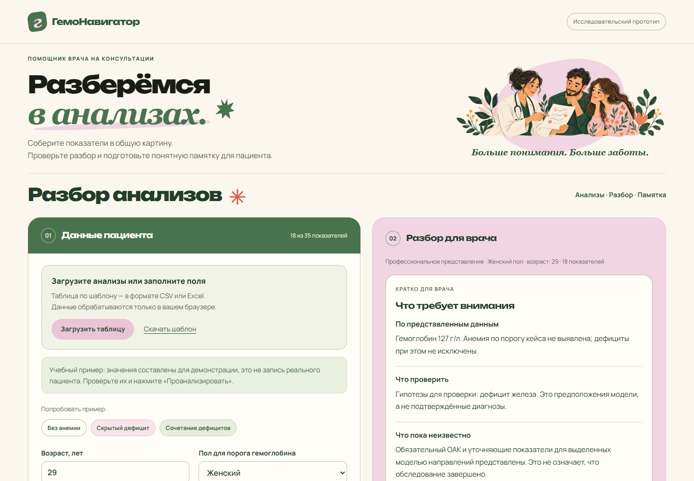

# ГемоНавигатор

**Помощник врача: от лабораторных показателей к понятной памятке пациенту.** Исследовательский MVP для хакатона по кейсу Сеченовского университета.



## Что умеет приложение

- Принимает результаты вручную или из CSV/XLSX и работает с отсутствующими показателями.
- Отдельно оценивает гемоглобин и предлагает гипотезы о дефицитах.
- Показывает врачу краткую сводку, недостающие данные и раскрываемое обоснование.
- Подготавливает редактируемую памятку пациенту с комментарием врача, печатью и сохранением в PDF.
- Выполняет расчёты локально в браузере; поддерживает автономный HTML без интернета.

Автоматические предположения не являются диагнозом. Клиническая эффективность на независимых данных не подтверждена.

## Быстрый запуск из репозитория

Нужен Node.js 20 или новее. Зависимости для запуска устанавливать не требуется.

```sh
npm start
```

Откройте `http://127.0.0.1:8765/`. Выберите «Скрытый дефицит», нажмите «Проанализировать», затем «Подготовить объяснение пациенту».

```sh
npm test
npm run build
```

Сборка создаст `release/hemonavigator.html`. Откройте этот файл двойным щелчком: шрифты, иллюстрация и модель уже встроены. В GitHub Actions выполняются те же проверки и сборка; после успешного запуска автономный файл доступен в артефакте `hemonavigator-offline`.

## Устройство проекта

```text
dist/                  Статический сайт и обученная модель
  app.js               Форма, разбор, импорт и связь компонентов
  engine.js            Расчёт моделей и ограничения применимости
  workflow.js          Сводка врачу и памятка пациенту
  import.js            Чтение CSV и XLSX
  model.json           Две версии модели и классификаторы дефицитов
  schema.json          Поля, единицы и диапазоны обучающей выборки
training/              Воспроизводимый код обучения
tests/                 Проверки порогов, пропусков и импорта
docs/                  Описание разработки и изображение интерфейса
model-evaluation.json  Агрегированные результаты проверки модели
DEMO.md                Сценарий защиты за три минуты
DESIGN.md              Палитра, шрифты и иллюстрация
```

История разработки и использование ИИ описаны в [docs/DEVELOPMENT.md](docs/DEVELOPMENT.md). Исходный датасет пациентов не опубликован.

Веб-прототип интерпретации лабораторных показателей. Ввод вручную или CSV/XLSX, работа с пропусками, краткий разбор для врача и редактируемая памятка пациенту. Все вычисления выполняются в браузере; исходные записи пациентов в приложение не включены.

## Запуск готового автономного файла

Откройте файл `hemonavigator.html` в Edge или Chrome двойным щелчком. Он находится рядом с папкой проекта. Интернет и установка программ для него не нужны. Это автономная сборка сайта, а не PDF или макет.

Выберите учебный пример и нажмите «Проанализировать». Врач видит краткую сводку, состав данных и раскрываемые основания. Нажмите «Подготовить объяснение пациенту», отредактируйте текст, добавьте следующий шаг и свой комментарий. После проверки отметьте соответствующий пункт и нажмите «Печать памятки»; в окне браузера можно сохранить PDF. При изменении анализов, выборе другой записи, очистке формы или повторном расчёте памятка и отметка проверки сбрасываются. При редактировании текста снимается отметка проверки. Данные и комментарии не сохраняются после перезагрузки страницы.

## Запуск исходного сайта

При установленном Node.js: из папки проекта запустите `node serve.mjs` и откройте `http://127.0.0.1:8765/`. Для другого порта задайте переменную `PORT`. Сервер доступен только на этом компьютере и не принимает загружаемые анализы. Остановка — Ctrl+C.

После изменений исходников пересоберите автономный файл: `node build-offline.mjs`.

## Данные и ввод

- Источник обучения: переданный пользователем CSV, 840 строк и 48 столбцов. Словарь: `variables.xlsx`, 48 описаний и единицы.
- Допустимые пользовательские поля: возраст, пол и 35 лабораторных показателей; `dist/schema.json` содержит описания и единицы.
- Для оценки анемии нужны возраст, пол и Hb. Для модели причин дополнительно нужны RBC, гематокрит, MCV, MCH, MCHC, тромбоциты и WBC. RDW и остальные показатели допускают пропуски.
- Возраст интерфейса 18–93 года, по представленному датасету. Беременность и дети вне области применения; статистика эффективности в отдельных возрастных группах не подтверждена.
- CSV: UTF-8 или Windows-1251; разделитель запятая, точка с запятой или табуляция. Десятичная запятая поддерживается, если не конфликтует с разделителем; используйте кавычки или разделитель `;`.
- XLSX: первый лист, заголовки в первой строке, результаты начиная со второй. Формулы не принимаются; сохраните значения. Старый XLS, PDF и фотографии не поддерживаются.
- До 1000 записей и 5 МБ в файле. При нескольких записях появляется переключатель.
- Используйте заголовки шаблона `dist/template.csv` и единицы словаря. Автоматического преобразования единиц пока нет. Загрузку обязательно проверяют в форме.
- Метки диагнозов и идентификаторы игнорируются при импорте. Пользовательские данные не сохраняются в localStorage и не передаются по сети. Внешние ссылки на рекомендации открываются только по нажатию.

## Модель и проверка

Две версии Random Forest: ОАК и расширенные показатели. Для каждой обучены классификатор 12 групп и шесть отдельных моделей бинарных признаков: дефициты железа, B12, фолатов, B6, меди и воспалительный профиль. Анемия определяется отдельным правилом Hb из кейса: менее 120 г/л для женщин и менее 130 г/л для мужчин.

Разделение: 630 строк для обучения и 210 для отложенного теста, со стратификацией по классу. Настройки выбраны по четырёхчастной кросс-валидации только на обучающей части. Импутация медианами выполняется внутри каждой обучающей части. Диагностические метки и patient_id исключены из признаков. Модель приложения обучена на тех же 630 строках, тест не добавлен в финальное обучение.

| Режим | Accuracy, 12 классов | Macro-F1 |
|---|---:|---:|
| Расширенные анализы | 84,3% | 0,834 |
| Только ОАК | 52,4% | 0,438 |
| Расширенная модель, дополнительно скрыта половина дополнительных значений | 66,2% | 0,609 |

Это результаты классификаторов до защитных ограничений интерфейса. Интерфейс отдельно воздерживается от оценки причин при неполном обязательном ОАК или значениях вне диапазонов обучения. Число таких записей и метрики внутри диапазонов указаны в `model-evaluation.json`.

Для отдельного класса скрытого железодефицита в тесте было лишь 21 наблюдение: расширенная модель нашла 20 из 21. Это не клиническая чувствительность и не доказательство работоспособности на пациентах других источников.

Базовая модель, использующая только наличие/отсутствие анализов, дала accuracy 25,7%: структура назначений связана с разметкой. Это риск переноса модели в другую практику. Происхождение и способ подтверждения диагнозов организаторами не документированы в переданных файлах.

Пропуски заменяются медианами обучения только внутри расчёта. В отчёте они остаются неизвестными. При наличии только ОАК подробное заключение о причинах ограничено из-за низкого общего качества. В раскрываемом обосновании для врача доступны исходные баллы. Баллы не откалиброваны и не являются вероятностями диагноза. Порог сигнала отдельного дефицита 0,50 — технический порог, не клинически валидированный.

Объяснение модели: каждый введённый показатель по очереди заменяется медианой обучения; показываются пять наибольших изменений балла ведущего класса. Это приближённая чувствительность, не SHAP, не причинное объяснение и не оценка отклонений от лабораторных референсов.

## Воспроизведение обучения

Python 3.12. Установите `training/requirements.txt` в собственное виртуальное окружение и выполните:

```text
python training/train.py --data "путь/к/deficiency_anemia.csv" --dictionary "путь/к/variables.xlsx" --audit-dir "папка/для/проверки"
```

В `audit-dir` сохраняются временные данные для проверки совпадения Python и браузерного расчёта; они содержат часть исходных признаков, поэтому не включайте эту папку в публикацию. Исходный CSV, словарь и временные записи не включены в архив проекта. После обучения выполните `node build-offline.mjs`.

## Медицинские основания и границы

- Порог Hb из задания кейса. Рекомендации ВОЗ: https://www.who.int/publications/i/item/9789240088542
- Интерпретация железодефицита: https://pmc.ncbi.nlm.nih.gov/articles/PMC8515119/
- Диагностика B12: https://www.nice.org.uk/guidance/ng239/chapter/recommendations

Прототип не устанавливает диагноз, не исключает дефициты и не назначает препараты. Словарь не содержит клинических референсных диапазонов. Проверка вне диапазонов обучения — техническое ограничение применимости, не медицинская норма. Низкий Hb оценивается отдельно, даже когда модель причин воздерживается от ответа.

## Статус размещения

Локальная и автономная версии предназначены для демонстрации. Публикация через Sites не завершена: вызов регистрации завершился транспортной ошибкой. Последующая успешная проверка списка принадлежащих пользователю сайтов вернула пустой список. Размещённого URL у этой сборки нет. Перед будущей регистрацией проверьте список сайтов по имени и slug `hemonavigator-hackathon`, чтобы избежать дублирования.

## Выполненная проверка приложения

- Численный расчёт в JavaScript совпал с Python на 16 отложенных записях для двух моделей; максимальное расхождение около 5,6 × 10⁻¹⁷.
- Проверены три учебных сценария, порог Hb, неполные и ошибочные данные, сброс устаревшего отчёта при редактировании, подготовка и редактирование памятки, снятие отметки проверки после правок, очистка памятки при смене записи.
- Проверен импорт CSV с десятичной запятой, XLSX и исходного CSV из 840 записей; метки диагнозов не попали в форму.
- Проверены настольный и узкий экраны в Microsoft Edge. Ошибок выполнения страницы не обнаружено.
- Автономный HTML проверен в браузере с отключённой сетью: расчёт, CSV-импорт и скачивание шаблона работают. Исходящих HTTP-запросов при этой проверке не было.
- Необязательный WebMCP инструмент заполнения формы включается только в поддерживающем браузере. Нативный контекст WebMCP в среде проверки отсутствовал; эта интеграция не проверена. Она не требуется для работы интерфейса.

## Следующие улучшения после MVP

Внешняя проверка на независимых данных, уточнение происхождения и критериев разметки, калибровка баллов, проверка отдельных возрастных групп, устойчивость к изменению назначения анализов, поддержка конкретных лабораторных бланков PDF. До этого клиническое применение не заявляется.

## Сценарий врача и пациента

Основной пользователь — врач. В верхней части разбора показаны гемоглобин, гипотезы для проверки и ограничения данных. Полный список отсутствующих показателей раскрывается отдельно; он не является списком обязательных назначений. Черновик для пациента использует более простой язык и содержит отдельное поле комментария врача. Автоматических назначений нет; следующий шаг врач формулирует сам. Отметка проверки — действие пользователя, а не проверка его квалификации или электронная подпись. При печати через меню браузера непроверенная памятка явно помечается как черновик.
