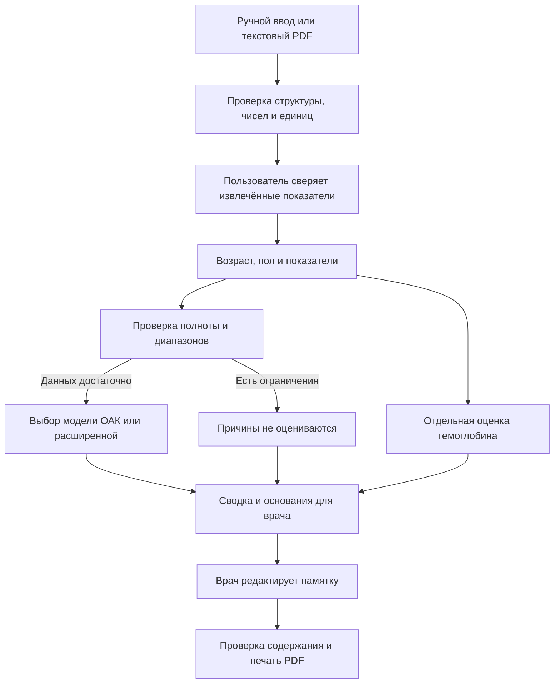

# Архитектура «Леи»

Приложение состоит из статического интерфейса и экспортированных моделей. Сервер передаёт файлы сайта. Анализы читаются и обрабатываются в памяти браузера.

## Компоненты

| Модуль | Ответственность |
|---|---|
| `dist/app.js` | Состояние формы, проверка PDF пользователем, валидация, вывод результата |
| `dist/pdf-import.js` | Локальное чтение PDF.js, координаты столбцов, сопоставление показателей, проверка единиц и повторов |
| `dist/import.js` | Проверка подозрительных чисел; табличные функции для разработческих тестов, не подключённые к загрузке в интерфейсе |
| `dist/engine.js` | Чистые функции оценки Hb, исполнения деревьев, ограничений и чувствительности |
| `dist/workflow.js` | Сводка врачу, черновик памятки, отметка проверки и печать |
| `dist/localization.js` | Русские названия, единицы и аббревиатуры |
| `training/train.py` | Обучение в Python и экспорт деревьев в JSON |
| `serve.mjs` | Статическая раздача `dist/` по GET/HEAD |
| `build-offline.mjs` | Встраивание ресурсов и модели в один HTML |

## Состояние и разделение ответственности

Форма хранит исходный ввод. После проверки числа поступают в расчёт, пустые поля становятся `null`. Медианы используются только внутри модели и не подставляются в форму как реальные измерения.

Изменение ввода делает старый результат неактуальным и очищает памятку. Редактирование памятки снимает отметку проверки. Врач проверяет факты и задаёт дальнейшую тактику. Пациент получает сохранённую или распечатанную памятку. Отдельных аккаунтов, базы пациентов и обмена сообщениями в MVP нет.

Текст формируется шаблонами. LLM и внешние сервисы анализа не вызываются. Необязательный WebMCP заполняет форму в поддерживающем браузере, но не запускает оценку автоматически.

## Развёртывание

Для разработки используется Node.js, для воспроизводимого запуска добавлен Docker, для защиты доступен автономный HTML. Модель одинаковая во всех вариантах. Размещение файлов на хостинге само по себе не создаёт медицинский сервер, учётные записи или защищённое хранилище.
